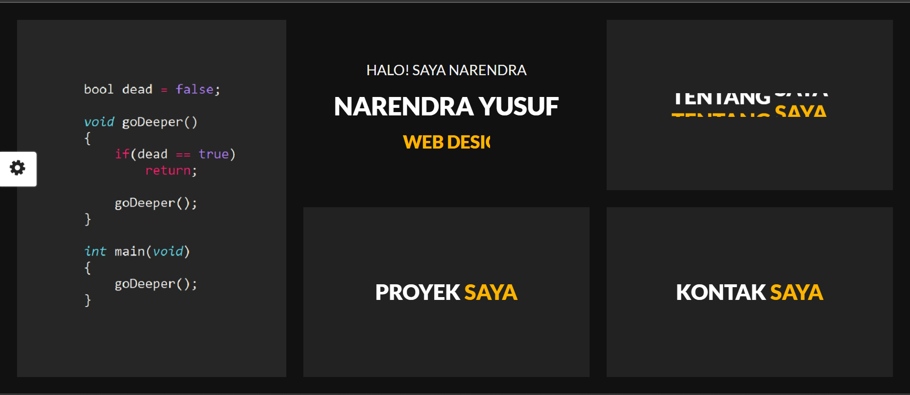

# Personal-Portofolio-V.1.0
Newly optimized and even more mobile friendly

# My Portfolio

Welcome to my portfolio repository! This portfolio showcases my experiences and projects developed from 2019 to the present. The website also features a customizable dark and light theme that you can switch on the left side of the browser.

## Preview

## Features

- Detailed information about my work experiences and skills
- Showcasing a collection of projects completed from 2019 to the present
- Customizable dark and light theme for better user experience

## Technologies Used

- HTML
- CSS
- JavaScript (for theme switching functionality)

## Getting Started

To get a local copy up and running, follow these simple steps:

1. Clone the repository: `git clone [https://github.com/NarendraYSF/Personal-Portofolio-V.1.0.git]`
2. Open the `index.html` file in your preferred web browser.

## Usage

Feel free to explore my portfolio to learn more about my background, experiences, and the projects I've worked on.

## Contributions

I appreciate any contributions and feedback. If you would like to contribute, please follow these steps:

1. Fork the project
2. Create your feature branch
3. Commit your changes
4. Push to the branch 
5. Open a pull request

## License

This project is licensed under the [MIT](license.txt) License

## Contact

Feel free to reach out to me through the following channels:

- Email: rendra.narendrayusuf@gmail.com
- LinkedIn: [My LinkedIn Profile](https://www.linkedin.com/in/narendrayusufk/)
- Twitter: [My Twitter Profile](https://twitter.com/narendraysf)

## Acknowledgements

I would like to thank Contributors, for inspiring me to create this portfolio.

